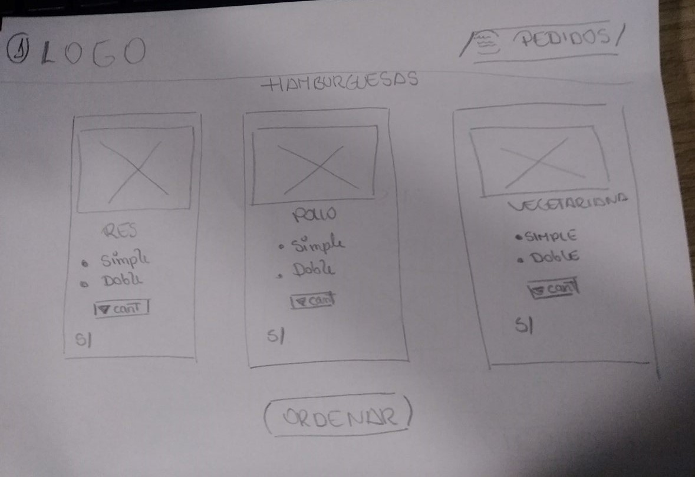
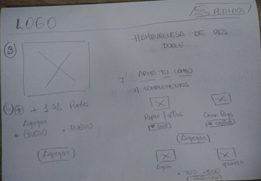

# Burguer Queen

Somos **Burguer Queen**, una cadena de comida rápida 24hrs.

## Entregables

* Realizarán un _fork_ de este repositorio. Este trabajo es **colaborativo**,
por lo tanto se evaluará que esté desarrollado equitativamente entre sus
integrantes

* Deberán incluir mínimo 2 ramas (aparte de master y gh-pages) las cuales
tendrán que estar integradas en el master al momento de la entrega,
**cada rama deberá tener de 5 a más commits por integrante**

* Recuerden que deben actualizar este README con la descripción de su proyecto

## Requisitos del negocio

Nuestra propuesta de servicio 24hrs ha tenido muy buena acogida, y para
expandirnos necesitamos un sistema que nos ayude a tomar los pedidos de los
clientes.

- Tenemos 2 menús: uno para el desayuno, que es bien sencillo:

| Item                      |Precio|
|---------------------------|:----:|
| Cafe americano            |    5 |
| Cafe con leche            |    7 |
| Sandwich de jamón y queso |   10 |
| Jugo natural              |    7 |

- Y un menú para el resto del dia:

| Hamburguesas              |Precio|
|---------------------------|:----:|
| Simple                    |   10 |
| Doble                     |   15 |

| Acompañamientos           |Precio|
|---------------------------|:----:|
| Papas fritas              |    5 |
| Onion Rings               |    5 |

| Bebidas                   | 500ml| 750ml|
|---------------------------|:----:|:----:|
| Agua                      |    5 |    8 |
| Gaseosa                   |    5 |   10 |

Los clientes pueden escoger entre hamburguesas de res, de pollo, o vegetariana.
**Y por S/. 1 pueden agregarle queso o huevo.**

Nuestros clientes son bastante indecisos, por lo que es muy común que cambien el
pedido varias veces antes de finalizarlo.

## Diseño

Este diseño nos gusta porque nuestros pedidos los tomaremos desde una tablet,
pero no queremos una app nativa. Necesitamos botones grandes para escoger los
productos, y el estado actual del pedido siempre visible para poder confirmar
con el cliente su pedido.

## Adicionales

Una vez que tengamos el sistema básico implementado, nos gustaría explorar
nuevas posibilidades, y estamos abiertos a cualquier sugerencia que tengan.
Algunas de las ideas que nos ha sugerido nuestros clientes son: agregar combos
al menú, cupones de descuento, descuento por pago con efectivo, programa de
fidelidad, etc.

***

## Requisitos técnicos

Tu "Single page app" debe tener las siguientes características:

* Estar desarrollada íntegramente en `ES6` y empaquetada de manera automatizada
  con `babel` o `webpack`
* Utilizar `React` y `Redux`
* Con por lo menos 10 componentes que especifiquen todas sus props, 3 reducers
  no atomicos (JSON) y 3 actions
* Contar con scripts `run`, `build` y `deploy`, que se encarguen de correr,
  empaquetar y desplegar la aplicación respectivamente
* Diseño *responsive* y *mobile*. El cliente va a usar el sistema en un
  **navegador**, pero en **tablets**.
* Despeglado en **Github pages**
* Haber administrado y documentado todo el proceso de creación de la aplicación
  en github
* Al día de la demo, la aplicación deberá estar publicada en una URL accesible
  universalmente
* No es necesario implementar rutas
* No es necesario implementar persistencia
* No es necesario implementar conexiones remotas

-------------------------------------------

## **BURGUER QUEEN**

Somos Burguer Queen, una cadena de establecimientos de comida rapida, especializados en la venta de hamburguesas,
 ofrecemos el servicio de delivery las 24 horas.

## Planificación

Para una planificacion segura y eficaz se utilizo TRELLO,  gestor de tareas que permite el trabajo de forma colaborativa.

Dividimos nuestras tareas por semana:

**SEMANA 1**
- Formar equipo.
- Hacer fork de reto modelo.
- Escribir primera versión del README.md con una descripción general del proyecto.
- Crear issues y milestones que sirvan como hoja de ruta (roadmap)
- Inicializar proyecto con npm init y git init.

**SEMANA 2**

- Implementar funcionalidad esencial.
- Actualizar el Readme.md con las nuevas caracteristicas del proyecto.
- Preparar  demo/presentación.
- Publicar el ejemplo principal en GitHub pages.
- Hacer code review con tus compañeras e instructorxs.
-

Puedes visitar nuestro tablero ingresando https://trello.com/b/GCkBdcs5/react

## desarrollo

Como equipo, lo primero q realizamos fue desarrollar el diseño y el flujo de nuestra aplicacion.

La siguiente imagen muestra la primera vista de nuestra aplicacion, en donde el usuario puede general el pedido de las hamburguesas de su preferencia y despues le da click en el boton ordenar

Esta imagen es nuestra segunda vista, donde el usuario puede armar su combo y añadir complementos como papas fritas, aros de cebolla o gaseosas.

## Autores

- **Wendy Quispe** - [@wendytamara](https://github.com/wendytamara)
- **Jennifer Carmen** - [@jennifercarmen](https://github.com/jennifercarmen)

## Licencia

Este proyecto está licenciado bajo la Licencia ISC - ver el archivo [LICENSE](https://www.isc.org) para más detalles.

Copyright &copy; 2018 All Rights Reserved.
